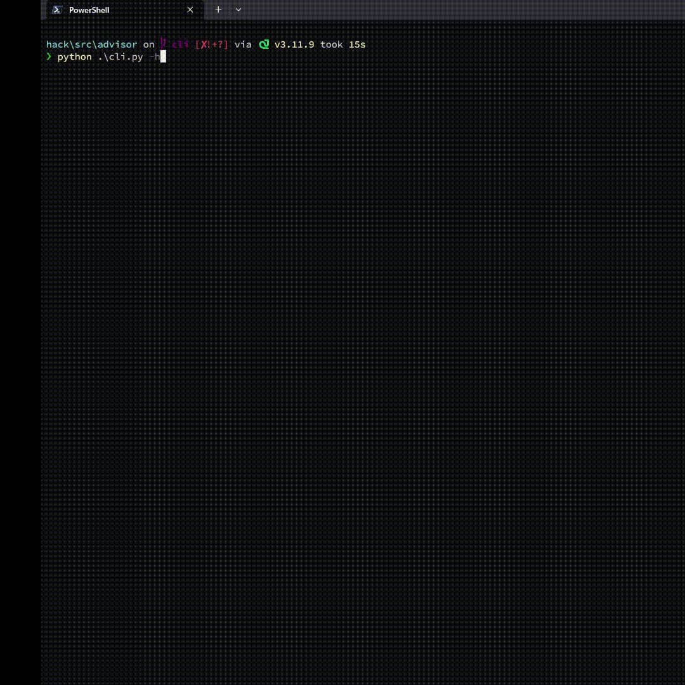

# Bicep Role Advisor

## Overview
This tool recommends the miniumum roles required to create the infrastructure in Azure by parsing the bicep files. 



## How to Run
1. Clone the repository
2. Updated `cred.json`: 
    ```json
    {
        "ENDPOINT_URL": "<Your Azure OpenAI service URL>",
        "AZURE_OPENAI_API_KEY": "<OpenAI Service API Key>",
        "PROMPT_FLOW_API_URL": "<Prompt Flow Infrence URL>",
        "PROMPT_FLOW_API_KEY": "<Prompt Flow API Key>"
    }
    ```
3. Run any of the following command:
    ```bash
    python .\cli.py -d <Directory Path>
    ```
    ```bash
    python .\cli.py -g <Git Repo Link>
    ```
